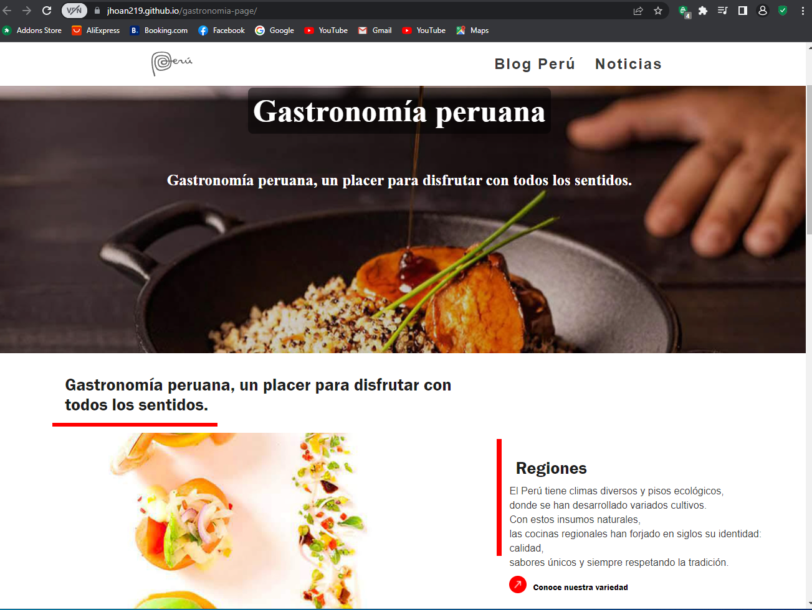

#[Gastronomia Peru Page](https://jhoan219.github.io/gastronomia-page/) | 

 
 
Pagina web desarrollada en HTML, CSS Y JAVASCRIPT

## Instalación
- Ubicarse en la carpeta que contendrá el proyecto
- Abrir terminal de comandos
  - git clone https://github.com/jhoan219/gastronomia-page.git
  

## Tecnologías usadas
| HTML | CSS |
| JAVASCRIPT | --- |
 

## Redes sociales
- LinkedIn: https://www.linkedin.com/in/jhoan-labra-lopez-16587b214/

- GitHub: https://github.com/jhoan219

- WhatsApp: https://api.whatsapp.com/send?phone=51963428337

- Personal Web:  

- Correo: labrajhoan219@gmail.com
